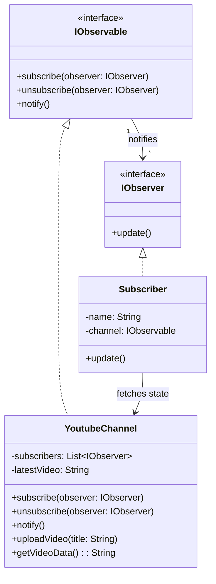

# Day 12 - Observer Design Pattern

## 1. The Core Concept
The **Observer Design Pattern** defines a one-to-many dependency between objects. When one object (the **Subject/Observable**) changes its state, all its dependents (the **Observers**) are notified and updated automatically.

**Real-World Analogy:**
Think of a YouTube channel. Instead of checking the channel every 5 minutes to see if a new video is uploaded (**Polling**), you hit the "Subscribe" button. When the creator uploads a video, YouTube sends a notification to all subscribers (**Pushing**). 
*   **Polling (Bad):** Continuous, resource-heavy checking.
*   **Pushing (Good):** The subject actively notifies dependents only when an event occurs.

---

## 2. Architecture & Components



### The Workflow:
1.  **Subscribe:** Observers register themselves with the Observable. The Observable keeps a list of these observers.
2.  **State Change:** The Observable does some business logic (e.g., `uploadVideo()`).
3.  **Notify:** The Observable loops through its list of observers and calls their `update()` method.
4.  **Fetch Data:** The Observer's `update()` method triggers a callback to the Observable to fetch the newly updated data (`getVideoData()`).

---

## 3. Java Implementation Example
For a clean, enterprise-level implementation, we rely on Interfaces to keep the system loosely coupled.

```java
// 1. Interfaces
interface IObserver {
    void update();
}

interface IObservable {
    void subscribe(IObserver observer);
    void unsubscribe(IObserver observer);
    void notifyObservers();
}

// 2. Concrete Observable (The Subject)
class YoutubeChannel implements IObservable {
    private List<IObserver> subscribers = new ArrayList<>();
    private String latestVideo;

    @Override
    public void subscribe(IObserver observer) { subscribers.add(observer); }

    @Override
    public void unsubscribe(IObserver observer) { subscribers.remove(observer); }

    @Override
    public void notifyObservers() {
        for (IObserver sub : subscribers) {
            sub.update(); // Pushing the notification
        }
    }

    public void uploadVideo(String title) {
        this.latestVideo = title;
        notifyObservers(); // Trigger notification on state change
    }

    public String getVideoData() { return this.latestVideo; }
}

// 3. Concrete Observer
class Subscriber implements IObserver {
    private String name;
    private YoutubeChannel channel; // Reference to fetch data later

    public Subscriber(String name, YoutubeChannel channel) {
        this.name = name;
        this.channel = channel;
    }

    @Override
    public void update() {
        // Fetching the exact state from the observable
        System.out.println("Hey " + name + ", check out the new video: " + channel.getVideoData());
    }
}
```

---

## 4. Trade-offs & Practical Use Cases
*   **SRP Violation Trade-off:** In this pattern, the `YoutubeChannel` class handles both *business logic* (uploading videos) and *observer logic* (subscribing, notifying). While this technically violates the **Single Responsibility Principle (SRP)**, it is a widely accepted trade-off to keep the pattern simple and functional without over-engineering.
*   **Where it's used:**
    *   **Event Handling:** UI button clicks (`addEventListener` in React/JS).
    *   **Notification Systems:** Sending emails/SMS when an order status changes.
    *   **Publish-Subscribe Systems:** Message brokers like Kafka or RabbitMQ use an advanced, decoupled version of this pattern (Pub-Sub).
