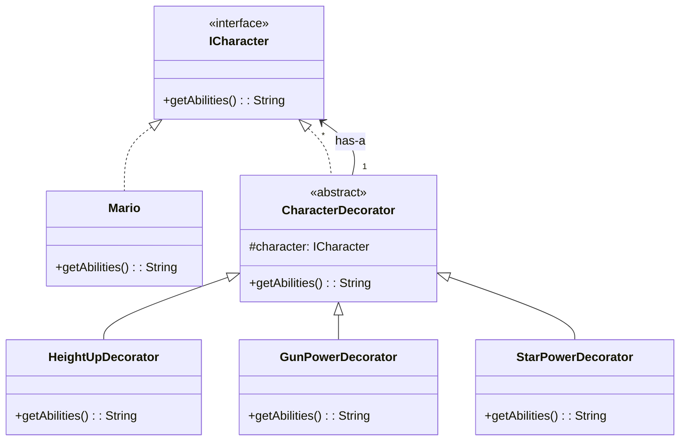

# Day 13 - Decorator Design Pattern

## 1. The Core Concept
The **Decorator Design Pattern** attaches additional responsibilities or functionalities to an object dynamically at runtime. It provides a flexible alternative to subclassing (inheritance) for extending functionality.

**The Problem with Inheritance:**
If we rely solely on inheritance to add features to an object, we run into the **"Class Explosion"** problem. For example, if a Mario character can have a Height-Up, a Gun, and Star Power, trying to create subclasses for every possible combination (`MarioWithHeightUp`, `MarioWithGun`, `MarioWithHeightUpAndGun`, etc.) results in an unmanageable, massive class hierarchy.

**The Decorator Solution:**
Instead of inheriting, we **wrap** the original object inside a "Decorator" object. The decorator has the same interface as the original object, meaning it can be passed around just like the original. We can stack these decorators infinitely at runtime.

---

## 2. Architecture & Components (UML)



### The "Is-a" and "Has-a" Magic
The core of the Decorator pattern lies in the `CharacterDecorator` class:
1.  **Is-a Relationship:** It implements `ICharacter`. This allows a decorator to behave exactly like the base object, meaning we can pass a decorated object anywhere the base object is expected.
2.  **Has-a Relationship:** It holds a reference to an `ICharacter`. This allows the decorator to call the wrapped object's methods, get its output, and then add (decorate) its own functionality on top of it.

---

## 3. Java Implementation Example

```java
// 1. The Component Interface
interface ICharacter {
    String getAbilities();
}

// 2. Concrete Component
class Mario implements ICharacter {
    public String getAbilities() {
        return "Mario";
    }
}

// 3. The Base Decorator
abstract class CharacterDecorator implements ICharacter {
    protected ICharacter character; // Has-a relationship

    public CharacterDecorator(ICharacter character) {
        this.character = character;
    }
    
    public String getAbilities() {
        return character.getAbilities(); // Delegates to the wrapped object
    }
}

// 4. Concrete Decorators
class HeightUpDecorator extends CharacterDecorator {
    public HeightUpDecorator(ICharacter character) { super(character); }
    
    public String getAbilities() {
        return super.getAbilities() + " with Height-Up";
    }
}

class GunPowerDecorator extends CharacterDecorator {
    public GunPowerDecorator(ICharacter character) { super(character); }
    
    public String getAbilities() {
        return super.getAbilities() + " with Gun";
    }
}

// 5. Client Code (Stacking Decorators at Runtime)
public class Main {
    public static void main(String[] args) {
        // Basic Mario
        ICharacter mario = new Mario(); 
        
        // Wrap with Height-Up
        mario = new HeightUpDecorator(mario);
        
        // Wrap with Gun Power
        mario = new GunPowerDecorator(mario);
        
        // Output: "Mario with Height-Up with Gun"
        System.out.println(mario.getAbilities()); 
    }
}
```

---

## 4. Real-World Applications
1.  **Text Editors:** Applying styles to text. The base text can be wrapped in a `BoldDecorator`, then an `ItalicDecorator`, and then an `UnderlineDecorator`.
2.  **Web Request/Form Validation:** A base HTML form object can be passed through a chain of decorators: `EmailValidatorDecorator` -> `SqlInjectionCheckerDecorator` -> `XssSanitizerDecorator`.
3.  **Java I/O Streams:** The standard Java I/O library heavily uses the Decorator pattern. E.g., `new BufferedReader(new FileReader("file.txt"))`.
