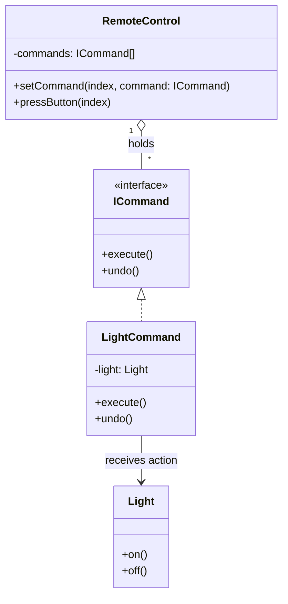

# Day 15 - Command Design Pattern

## 1. Introduction
The **Command Design Pattern** is a behavioral pattern that encapsulates a request (or an action) as an object. 
Instead of the `Source` directly calling a method on the `Receiver` (which tightly couples them), the `Source` invokes an intermediate `Command` object. This Command object knows exactly which receiver to call and what action to perform.

**The Golden Rule:** It allows you to decouple the sender of a request from its receiver, enabling features like parameterizing clients with different requests, queueing, logging, and **Undoable operations**.

---

## 2. The Problem (Smart Home Remote)
Imagine building an app for a Smart Home Remote Control. You have buttons on the remote and appliances like a Light, Fan, and AC.

*   **Bad Design (Tight Coupling):** You hardcode the remote buttons to the appliances. For example, `button1` directly calls `light.on()`.
*   **The Issue:** If tomorrow you buy a Smart Heater, or you want `button1` to control the Fan instead of the Light, you have to modify the Remote's source code. This violates the **Open-Closed Principle (OCP)**.

---

## 3. The Command Pattern Solution
We introduce a `Command` interface between the Remote (Invoker) and the Appliances (Receivers).



### The Workflow:
1.  **The Receiver (Light):** Contains the actual business logic (`on()`, `off()`).
2.  **The Command (LightCommand):** Implements `ICommand`. It holds a reference to the `Light` object. Its `execute()` method calls `light.on()`, and `undo()` calls `light.off()`.
3.  **The Invoker (RemoteControl):** Holds an array of `ICommand` objects representing buttons. When a button is pressed, it simply calls `commands[index].execute()`. The remote has zero knowledge about the Light or the Fan.

---

## 4. Java Implementation

```java
// 1. Command Interface
interface ICommand {
    void execute();
    void undo();
}

// 2. The Receiver
class Light {
    public void on() { System.out.println("Light is ON"); }
    public void off() { System.out.println("Light is OFF"); }
}

// 3. Concrete Command
class LightCommand implements ICommand {
    private Light light;

    public LightCommand(Light light) {
        this.light = light;
    }

    @Override
    public void execute() { light.on(); }

    @Override
    public void undo() { light.off(); }
}

// 4. The Invoker
class RemoteControl {
    private ICommand[] buttons;

    public RemoteControl(int size) {
        buttons = new ICommand[size];
    }

    // Dynamically assign commands to buttons
    public void setCommand(int index, ICommand command) {
        buttons[index] = command;
    }

    public void pressButton(int index) {
        if (buttons[index] != null) {
            buttons[index].execute();
        }
    }

    public void pressUndo(int index) {
        if (buttons[index] != null) {
            buttons[index].undo();
        }
    }
}

// 5. Client
public class Main {
    public static void main(String[] args) {
        Light livingRoomLight = new Light();
        ICommand lightCmd = new LightCommand(livingRoomLight);

        RemoteControl remote = new RemoteControl(4);
        
        // Map Button 0 to the Light
        remote.setCommand(0, lightCmd);

        // Turn ON and then Undo (Turn OFF)
        remote.pressButton(0); 
        remote.pressUndo(0);
    }
}
```

---

## 5. Real-World Applications & Use Cases
1.  **Undo/Redo Functionality:** Used extensively in Text Editors (MS Word, Google Docs), Photoshop, and IDEs. Every action (bold, delete, type) is a command object stored in a Stack. When you press `Ctrl+Z`, the application simply pops the last command from the stack and calls its `undo()` method.
2.  **Customizable Keybindings/Macros:** In gaming or software tools, users can bind a key (e.g., 'F') to an action (e.g., 'Heal'). The keyboard acts as the Invoker, holding Command objects for every key.
3.  **Task Queues & Background Jobs:** Commands can be serialized and pushed into a Queue or Message Broker (like RabbitMQ) to be executed asynchronously by worker threads later.
