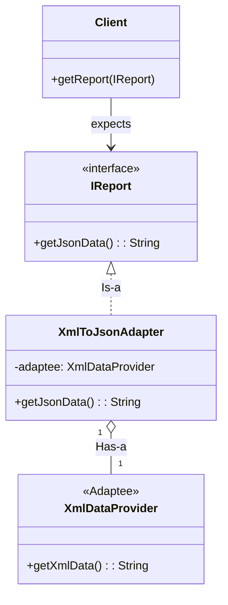

# Day 16 - Adapter Design Pattern

## 1. Introduction
The **Adapter Design Pattern** is a structural design pattern that allows incompatible interfaces to collaborate. It acts exactly like a real-world physical adapter (e.g., plugging an Indian charger into a US power socket, or converting a USB-C port to a USB-A port).

**The Golden Rule:** It converts the interface of a class into another interface that the client expects. It lets classes work together that couldn't otherwise because of incompatible interfaces.

---

## 2. The Problem (Incompatible Interfaces)
Imagine you are building an analytics dashboard. 
*   **Your Client/Application:** Expects data strictly in **JSON format** to render graphs.
*   **The Third-Party Library:** You find a great external library that provides analytics data, but it only exports data in **XML format**.

You cannot modify the 3rd party library (it's external/read-only), and modifying your entire client application to suddenly start accepting XML violates the **Open/Closed Principle** and creates **Tight Coupling**.

---

## 3. The Adapter Pattern Solution
We introduce an `Adapter` class between the Client and the Third-Party Library (Adaptee).



### The Workflow:
1.  **The Target (`IReport`):** The interface your client code currently understands and expects.
2.  **The Adaptee (`XmlDataProvider`):** The existing, incompatible class/library that has the actual data but in the wrong format.
3.  **The Adapter (`XmlToJsonAdapter`):** 
    *   It implements the target interface (`Is-a` relationship).
    *   It holds a reference to the Adaptee (`Has-a` relationship).
    *   When the client calls `getJsonData()`, the Adapter calls `getXmlData()` on the Adaptee, translates the XML to JSON, and returns it to the client.

---

## 4. Object Adapter vs. Class Adapter
There are two ways to implement an adapter:
1.  **Object Adapter (Preferred):** Uses **Composition** (Has-a). The adapter holds an instance of the Adaptee. This is the standard, most flexible approach (used in the diagram above).
2.  **Class Adapter:** Uses **Multiple Inheritance**. The adapter inherits from *both* the Target Interface and the Adaptee Class. Since Java does not support multiple inheritance of classes, and "Composition over Inheritance" is the golden rule of OOP, this approach is rarely used.

---

## 5. Java Implementation

```java
// 1. The Target Interface (What the Client expects)
interface IReport {
    String getJsonData(String rawData);
}

// 2. The Adaptee (The incompatible 3rd party library)
class XmlDataProvider {
    public String getXmlData(String rawData) {
        // Simulating raw data to XML conversion
        return "<xml><data>" + rawData + "</data></xml>";
    }
}

// 3. The Adapter
class XmlToJsonAdapter implements IReport {
    private XmlDataProvider adaptee;

    // Composition: Inject the Adaptee
    public XmlToJsonAdapter(XmlDataProvider adaptee) {
        this.adaptee = adaptee;
    }

    @Override
    public String getJsonData(String rawData) {
        // Step 1: Get data in the incompatible format
        String xmlData = adaptee.getXmlData(rawData);
        
        // Step 2: Translate/Adapt it
        System.out.println("Adapter: Translating XML to JSON...");
        String jsonData = "{ "data": "" + rawData + "" }"; // Simplified translation
        
        return jsonData;
    }
}

// 4. The Client
public class Main {
    public static void main(String[] args) {
        // We have an Adaptee
        XmlDataProvider thirdPartyApi = new XmlDataProvider();
        
        // We wrap it in an Adapter
        IReport adapter = new XmlToJsonAdapter(thirdPartyApi);
        
        // Client uses the Adapter as if it's the standard IReport interface
        System.out.println(adapter.getJsonData("Sales2026"));
    }
}
```

---

## 6. Real-World Applications & Use Cases
1.  **Integrating Third-Party Libraries (SDKs/APIs):** When you integrate Payment Gateways (Stripe, Razorpay) or Notification Services (Twilio). An adapter ensures your core business logic isn't tightly coupled to Razorpay's specific method names. If you switch to Stripe tomorrow, you just swap the Adapter.
2.  **Legacy Code Integration:** When migrating to a new modern system, but you still need to call old, deprecated systems (e.g., an old SOAP API). The adapter acts as an anti-corruption layer between the clean modern code and the messy legacy code.
3.  **Java I/O:** `InputStreamReader` is a classic adapter in the Java standard library. It adapts an `InputStream` (which reads bytes) to a `Reader` (which reads characters).
