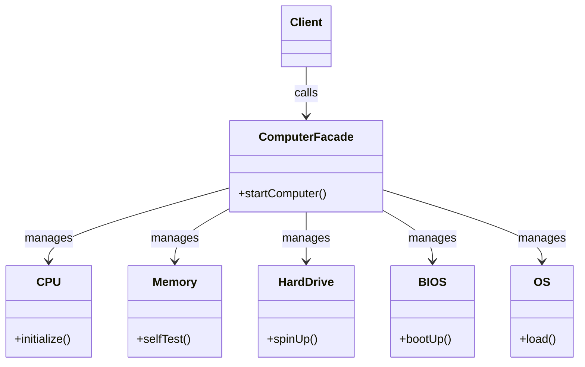

# Day 17 - Facade Design Pattern

## 1. Introduction
The **Facade Design Pattern** is a structural design pattern that provides a simplified, unified interface to a complex subsystem of classes, libraries, or frameworks. 

**The Golden Rule:** It hides the complexity of a system and exposes only what is necessary to the user (client). By introducing a "Facade" class, clients interact with this single gateway rather than communicating directly with dozens of intricately linked internal classes.

---

## 2. The Problem (Complex Subsystems)
Imagine what happens when you start your computer. You just press the Power button. But under the hood, a massive, complex subsystem of operations occurs:
*   The **CPU** initializes.
*   The **Memory** runs a self-test.
*   The **Hard Drive** spins up.
*   The **Power Supply** provides voltage.
*   The **BIOS** boots up using the CPU and Memory.
*   The **Operating System** loads.

If a client (you) had to write code to manually trigger all these classes in the correct order, it would create extreme **Tight Coupling**. If the computer's internal architecture changes, the client code breaks.

---

## 3. The Facade Pattern Solution
We introduce a `ComputerFacade` class that acts as the front-facing interface for the client.



### The Workflow:
1.  **The Subsystem:** A collection of complex classes (`CPU`, `Memory`, `BIOS`, etc.) that perform the actual heavy lifting. They do not know the Facade exists.
2.  **The Facade:** The `ComputerFacade` knows which subsystem classes are responsible for a request. It delegates client requests to appropriate subsystem objects.
3.  **The Client:** Only communicates with the `ComputerFacade` (e.g., calling `startComputer()`). It is completely decoupled from the internal subsystem.

---

## 4. Java Implementation

```java
// --- Subsystem Classes (Complex Internals) ---
class CPU {
    public void initialize() { System.out.println("CPU: Initialized"); }
}
class Memory {
    public void selfTest() { System.out.println("Memory: Self-Test Passed"); }
}
class HardDrive {
    public void spinUp() { System.out.println("Hard Drive: Spinning Up"); }
}
class OS {
    public void load() { System.out.println("OS: Loading Windows..."); }
}

// --- The Facade ---
class ComputerFacade {
    private CPU cpu;
    private Memory memory;
    private HardDrive hardDrive;
    private OS os;

    public ComputerFacade() {
        this.cpu = new CPU();
        this.memory = new Memory();
        this.hardDrive = new HardDrive();
        this.os = new OS();
    }

    // The simplified method exposed to the client
    public void startComputer() {
        System.out.println("Starting computer...");
        cpu.initialize();
        memory.selfTest();
        hardDrive.spinUp();
        os.load();
        System.out.println("Computer booted successfully!");
    }
}

// --- The Client ---
public class Main {
    public static void main(String[] args) {
        // Client interacts ONLY with the Facade
        ComputerFacade myComputer = new ComputerFacade();
        myComputer.startComputer();
    }
}
```

---

## 5. Principle of Least Knowledge (Law of Demeter)
The Facade Pattern is the ultimate implementation of the **Principle of Least Knowledge**.
**Rule:** "Talk only to your immediate friends." A class should know as little as possible about other classes.

If Class `A` has a reference to Class `B`, and Class `B` has a reference to Class `C`, **Class `A` should never call `B.getC().doSomething()`**. 
If `A` needs `C` to do something, `B` should provide a wrapper method so `A` only talks to `B`.

**Allowed Method Calls inside a Method `M` of Object `O`:**
1.  Methods of the object `O` itself.
2.  Methods of objects passed as arguments to `M`.
3.  Methods of objects created/instantiated inside `M`.
4.  Methods of objects held as instance variables within `O` (Has-a relationship).

---

## 6. Facade vs. Adapter Pattern
Both patterns act as wrappers, which causes confusion. The difference lies entirely in their **Intent**:
*   **Facade Pattern:** The intent is to **Simplify**. It wraps a complex subsystem of *many* classes to provide a single, easy-to-use interface.
*   **Adapter Pattern:** The intent is to **Translate**. It wraps a *single* object to change its interface into another interface that the client expects (e.g., XML to JSON).

---

## 7. Real-World Applications
1.  **Game Engines (e.g., Unity, Unreal):** When a developer calls `StartGame()`, a Facade handles loading assets, allocating memory, spinning up the physics engine, and initiating the rendering pipeline.
2.  **Payment Gateways:** Calling `processPayment()` hides the complexity of checking account balances, validating PINs, running fraud detection algorithms, and sending banking network requests.
3.  **Video Compression Libraries:** Using a library like FFmpeg is incredibly complex (involves audio parsers, video codecs, bit-rate calculators). A `VideoConverter` Facade provides a simple `convertVideo(file, "mp4")` method.
