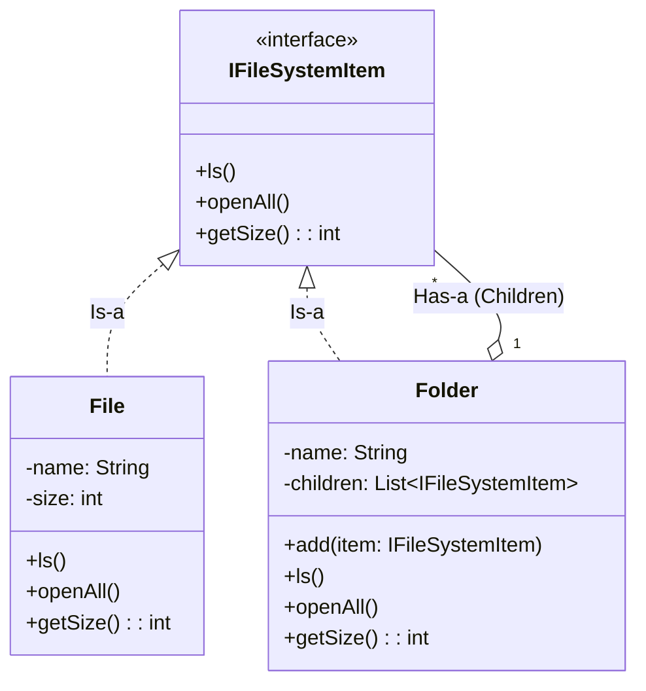

# Day 19 - Composite Design Pattern

## 1. Introduction
The **Composite Design Pattern** is a structural pattern used to represent **part-whole hierarchies**. It allows you to compose objects into tree-like structures and treat individual objects (leaves) and compositions of objects (branches/composites) uniformly.

**The Golden Rule:** If your problem can be represented as a Tree data structure (where nodes have children), and you want the client code to treat a single leaf node exactly the same as a complex branch node, use the Composite pattern.

---

## 2. The Problem (The File System)
Imagine designing a File System. You have `File` objects and `Folder` objects. A `Folder` can contain multiple `File`s and other `Folder`s. 

*   **Bad Design:** If you keep separate lists for files and folders inside your `Folder` class, operations like calculating the total size become a nightmare. You'd have to loop through everything and use `if (item instanceof File)` to fetch the size, and `else if (item instanceof Folder)` to trigger a recursive calculation. This violates polymorphism and makes the code tightly coupled.

---

## 3. The Composite Solution
We create a common interface (or abstract class) that both `File` (Leaf) and `Folder` (Composite) implement.



### The Workflow:
1.  **Component (`IFileSystemItem`):** The common interface declaring operations like `getSize()`.
2.  **Leaf (`File`):** The end node. It does the actual work (e.g., returning its base integer size).
3.  **Composite (`Folder`):** Contains a list of `IFileSystemItem`s. When `getSize()` is called, it iterates through its children, recursively calls `getSize()` on each, and sums up the total.

---

## 4. Java Implementation

```java
import java.util.ArrayList;
import java.util.List;

// 1. The Component Interface
interface IFileSystemItem {
    void ls();
    int getSize();
}

// 2. The Leaf (End Node)
class File implements IFileSystemItem {
    private String name;
    private int size;

    public File(String name, int size) {
        this.name = name;
        this.size = size;
    }

    @Override
    public void ls() {
        System.out.println("File: " + name);
    }

    @Override
    public int getSize() {
        return this.size;
    }
}

// 3. The Composite (Branch Node)
class Folder implements IFileSystemItem {
    private String name;
    private List<IFileSystemItem> children; // Holds both Files and other Folders!

    public Folder(String name) {
        this.name = name;
        this.children = new ArrayList<>();
    }

    public void add(IFileSystemItem item) {
        children.add(item);
    }

    @Override
    public void ls() {
        System.out.println("Folder: " + name);
        for (IFileSystemItem child : children) {
            child.ls(); // Polymorphic recursive call
        }
    }

    @Override
    public int getSize() {
        int totalSize = 0;
        for (IFileSystemItem child : children) {
            totalSize += child.getSize(); // Polymorphic recursive call
        }
        return totalSize;
    }
}

// 4. Client Code
public class Main {
    public static void main(String[] args) {
        File file1 = new File("resume.pdf", 2);
        File file2 = new File("photo.jpg", 5);
        File file3 = new File("notes.txt", 1);

        Folder docsFolder = new Folder("Documents");
        docsFolder.add(file1);
        docsFolder.add(file3);

        Folder rootFolder = new Folder("Root");
        rootFolder.add(docsFolder);
        rootFolder.add(file2);

        // Client treats the root folder exactly like a single file
        System.out.println("Total Size: " + rootFolder.getSize() + "MB");
    }
}
```

---

## 5. Real-World Applications & Use Cases
1.  **UI Frameworks & DOM:** In HTML/React, a `<div>` is a composite that can contain `<p>` tags (leaves) or other `<div>`s (composites). When you call a render function on the root, it recursively renders the entire DOM tree.
2.  **Organization Charts:** An `Employee` interface where an `IndividualContributor` is a leaf, and a `Manager` is a composite holding a list of other `Employee`s. Calculating the total salary of a department uses the exact same recursive logic.
3.  **E-commerce Categories:** Product categories that contain sub-categories, which contain items.
