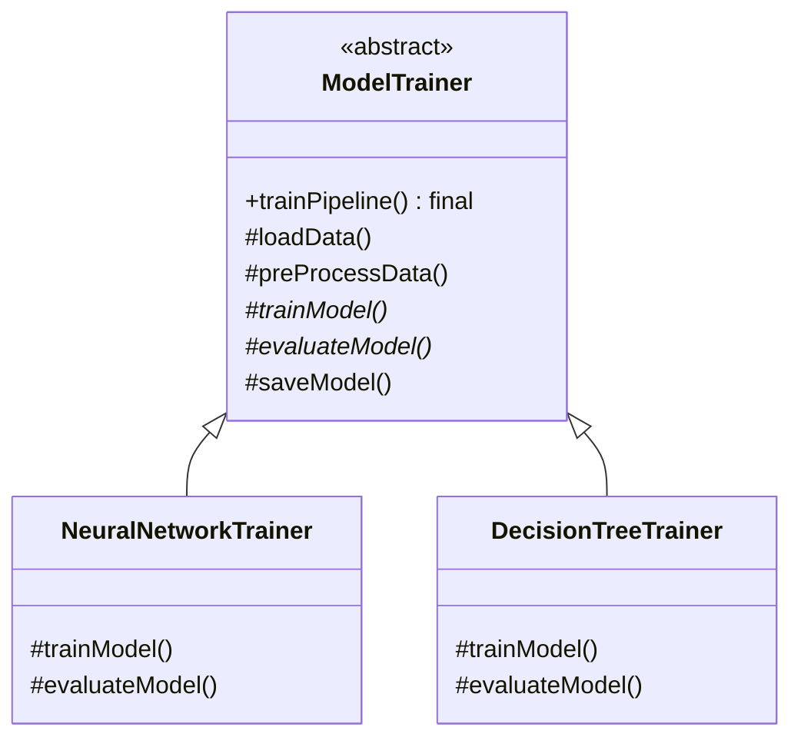

# Day 20 - Template Design Pattern

## 1. Introduction
The **Template Design Pattern** is a behavioral design pattern that defines the skeleton of an algorithm in a method, deferring some steps to subclasses. 

**The Golden Rule:** It lets subclasses redefine certain steps of an algorithm without changing the algorithm's overarching structure or order of execution. 

Now that we have covered foundational patterns (Strategy, Factory, Singleton, Observer, Decorator, Adapter, Facade, Composite, Command), we are moving into highly specific use-case patterns. The Template pattern is the ultimate solution for **Pipelines**.

---

## 2. The Problem (The Pipeline Issue)
Imagine you are building a Machine Learning library. Every time you train a model, you MUST follow a strict pipeline:
1. `loadData()`
2. `preProcessData()`
3. `trainModel()`
4. `evaluateModel()`
5. `saveModel()`

If you just provide an interface with these 5 methods, a junior developer creating a new `NeuralNetworkModel` might accidentally call `trainModel()` *before* `preProcessData()`, completely ruining the pipeline. 

---

## 3. The Template Solution
We create an abstract base class (`ModelTrainer`) that contains a **Template Method** (`trainPipeline()`). This template method hardcodes the exact order of operations. The subclasses can decide *how* to do the steps, but they cannot change the *order* of the steps.



### The Workflow:
1.  **The Template Method (`trainPipeline`)**: Marked as `final` so subclasses cannot override it. It dictates the strict pipeline order.
2.  **Common Steps (`loadData`, `saveModel`)**: Implemented in the base class because they are identical across all models. Subclasses can use them as-is.
3.  **Abstract Steps (`trainModel`, `evaluateModel`)**: Left abstract. The concrete subclasses *must* provide their own specific logic for these.

---

## 4. Java Implementation

```java
// 1. The Abstract Base Class
abstract class ModelTrainer {

    // THE TEMPLATE METHOD - Marked 'final' so it cannot be overridden
    public final void trainPipeline(String dataPath) {
        loadData(dataPath);
        preProcessData();
        trainModel();
        evaluateModel();
        saveModel();
    }

    // Common implementations shared by all subclasses
    protected void loadData(String dataPath) {
        System.out.println("Loading data from: " + dataPath);
    }

    protected void preProcessData() {
        System.out.println("Default: Splitting into Train/Test & Normalizing");
    }

    protected void saveModel() {
        System.out.println("Default: Saving model to disk...");
    }

    // Abstract steps that MUST be implemented by subclasses
    protected abstract void trainModel();
    protected abstract void evaluateModel();
}

// 2. Concrete Class 1: Neural Network
class NeuralNetworkTrainer extends ModelTrainer {
    @Override
    protected void trainModel() {
        System.out.println("Training Neural Network with 100 Epochs...");
    }

    @Override
    protected void evaluateModel() {
        System.out.println("Evaluating NN: Checking Accuracy and Log-Loss...");
    }
}

// 3. Concrete Class 2: Decision Tree
class DecisionTreeTrainer extends ModelTrainer {
    @Override
    protected void trainModel() {
        System.out.println("Training Decision Tree using Gini Impurity...");
    }

    @Override
    protected void evaluateModel() {
        System.out.println("Evaluating Tree: Checking F1 Score...");
    }
    
    // Subclass can optionally override default steps too
    @Override
    protected void preProcessData() {
        System.out.println("Decision Tree Preprocessing: No normalization needed.");
    }
}

// 4. Client Code
public class Main {
    public static void main(String[] args) {
        ModelTrainer nnTrainer = new NeuralNetworkTrainer();
        // Client only calls the template method!
        nnTrainer.trainPipeline("aws-s3://dataset/images.csv");

        System.out.println("-------------------------");

        ModelTrainer dtTrainer = new DecisionTreeTrainer();
        dtTrainer.trainPipeline("local://dataset/tabular.csv");
    }
}
```

---

## 5. Real-World Applications & Use Cases
1.  **Payment Gateways:** The pipeline is strict: `Validate Balance` -> `Debit Account` -> `Credit Merchant` -> `Save Transaction`. The Template method defines this flow, while `CreditCardPayment` and `UPIPayment` implement the specific debit/credit mechanisms.
2.  **Spring Boot Framework:** The Spring framework uses this everywhere. For example, `JdbcTemplate` or `RestTemplate`. They handle the boilerplate skeleton (opening connections, handling exceptions, closing connections) and let you provide just the specific SQL/HTTP logic.
3.  **Web Security Filters:** In Spring Security, `OncePerRequestFilter` has a template method `doFilter()`, and forces you to override the specific step `doFilterInternal()`.
