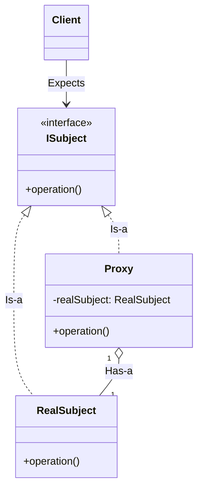

# Day 21 - Proxy Design Pattern

## 1. Introduction
The **Proxy Design Pattern** is a structural pattern that provides a surrogate or placeholder for another object to control access to it. 

**The Golden Rule:** It allows you to introduce an intermediary object (the Proxy) that stands in for a Real Object (the Resource). The Proxy catches requests from the Client, performs some logic (like authentication, lazy-loading, or network calls), and then passes the request along to the Real Object. The Client remains completely unaware that it is talking to a Proxy instead of the actual resource.

---

## 2. Architecture & Components (UML)



### The Workflow:
1.  **The Interface (`ISubject`):** Both the Proxy and the Real Object implement this same interface. This is what allows the Proxy to seamlessly substitute the Real Object (`Is-a` relationship).
2.  **The Real Subject:** The actual core object that performs the heavy lifting, contains critical data, or resides on a remote server.
3.  **The Proxy:** Holds a reference to the Real Subject (`Has-a` relationship). When its `operation()` is called, it executes its proxy logic (e.g., checking permissions) before manually calling `realSubject.operation()`.

---

## 3. The Three Types of Proxies

### A. Virtual Proxy (Lazy Loading)
*   **Purpose:** To delay the creation of a highly resource-intensive object (like a massive Image or a complex Database connection) until it is absolutely needed.
*   **How it works:** The Client creates the Proxy. The Proxy does *not* create the Real Object in its constructor. It only instantiates the Real Object the very first time the Client actually calls a method that requires the object's data.

### B. Protection Proxy (Authentication/Validation)
*   **Purpose:** To control access to a sensitive resource based on user permissions.
*   **How it works:** Before delegating the call to the Real Object, the Proxy checks if the Client has the correct credentials (e.g., checking `if(user.isPremium())` before unlocking a PDF).

### C. Remote Proxy (Network Calls)
*   **Purpose:** To represent an object that exists on a completely different server or address space.
*   **How it works:** The Client thinks it is calling a local object. However, the Proxy intercepts the local method call, establishes a network connection, serializes the request, sends it over the internet to the actual remote server, and returns the response.

---

## 4. Java Implementation (Virtual Proxy Example)

```java
// 1. The Interface
interface IImage {
    void display();
}

// 2. The Real Subject (Resource Intensive)
class RealImage implements IImage {
    private String fileName;

    public RealImage(String fileName) {
        this.fileName = fileName;
        loadFromDisk(); // Expensive operation happening in constructor
    }

    private void loadFromDisk() {
        System.out.println("Loading extremely heavy image from disk: " + fileName);
    }

    @Override
    public void display() {
        System.out.println("Displaying " + fileName);
    }
}

// 3. The Proxy
class ImageProxy implements IImage {
    private RealImage realImage; // Has-a relationship
    private String fileName;

    public ImageProxy(String fileName) {
        this.fileName = fileName;
        // Notice we DO NOT instantiate the RealImage here.
    }

    @Override
    public void display() {
        // Lazy Loading: Only create the heavy object when absolutely necessary
        if (realImage == null) {
            realImage = new RealImage(fileName); 
        }
        // Delegate the call to the real object
        realImage.display();
    }
}

// 4. Client Code
public class Main {
    public static void main(String[] args) {
        // The client gets the Proxy. No heavy loading happens yet!
        IImage image = new ImageProxy("high_res_photo.jpg");

        System.out.println("Client is doing some other work...");

        // The image is only loaded from disk RIGHT before it is displayed.
        image.display(); 
        
        System.out.println("---");
        
        // Second call doesn't trigger disk load, uses the cached RealImage.
        image.display(); 
    }
}
```

---

## 5. Real-World Applications & Use Cases
1.  **Spring AOP & Hibernate:** In Spring Boot, when you use annotations like `@Transactional` or `@Cacheable`, Spring creates a Proxy around your class. It intercepts your method call, starts a database transaction (proxy logic), calls your actual method, and then commits the transaction. Hibernate uses Virtual Proxies for "Lazy Loading" entities from the database only when `.get()` is explicitly called.
2.  **Microservices (Remote Proxy):** In a microservice architecture, Service A talks to Service B using an API Client (like Netflix Feign or gRPC stubs). These clients are Remote Proxies. Service A calls a local Java interface, but the Proxy translates that into an HTTP request over the network.
3.  **Security Frameworks:** Spring Security uses Protection Proxies (Filters) to intercept web requests and validate JWT tokens before allowing the request to hit the actual Controller endpoint.
